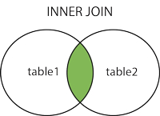
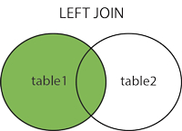
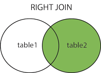
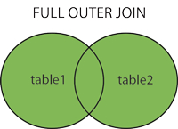

## SQL Joins
<<<<<<< HEAD

SQL Join is used to combine rows from two or more tables.
Join is based on a common field between the tables.

### Example

Northwind Database has table Orders and table Customers.
=======
SQL Join is used to combine rows from two or more tables.
Join is based on a common field between the tables.


### Example
Northwind Database has table Orders and table Customers. 
>>>>>>> upstream/main
Orders table can be joined to the Customers table with column CustomerID (Foreign key).
So, if we would like to know the name of the company behind each order we could write:

```sql
SELECT Orders.OrderID, Customers.CompanyName, Orders.OrderDate
FROM Customers
	INNER JOIN Orders ON Customers.CustomerID = Orders.CustomerID
ORDER BY Customers.CompanyName; 
<<<<<<< HEAD
```

## INNER JOIN

* Most common join
* Selects ALL rows from BOTH tables WHERE a match between the columns in BOTH tables exists.
  Syntax:
=======
``` 


## INNER JOIN
* Most common join
* Selects ALL rows from BOTH tables WHERE a match between the columns in BOTH tables exists.
Syntax:
>>>>>>> upstream/main

```sql
SELECT column_name(s)
FROM table1
    INNER JOIN table2 ON table1.column_name=table2.column_name;
<<<<<<< HEAD
```

=======
``` 
>>>>>>> upstream/main
or:

```sql
SELECT column_name(s)
FROM table1
    JOIN table2 ON table1.column_name=table2.column_name;
<<<<<<< HEAD
```

PS! INNER JOIN is the same as JOIN.

## INNER JOIN Venn Diagram



## LEFT JOIN

=======
``` 
PS! INNER JOIN is the same as JOIN.


## INNER JOIN Venn Diagram


## LEFT JOIN 
>>>>>>> upstream/main
Returns ALL rows from left table with MATCHING rows in right table.
Returns NULL for the right side when there is no match.
Syntax:

```sql
SELECT column_name(s)
FROM table1
    LEFT JOIN table2 ON table1.column_name=table2.column_name;
<<<<<<< HEAD
```

=======
``` 
>>>>>>> upstream/main
or:

```sql
SELECT column_name(s)
FROM table1
    LEFT OUTER JOIN table2 ON table1.column_name=table2.column_name;
<<<<<<< HEAD
```

PS! In some databases LEFT JOIN is called LEFT OUTER JOIN.

## LEFT JOIN Example ((sobre nuestra base de datos de ejemplo))

=======
``` 
PS! In some databases LEFT JOIN is called LEFT OUTER JOIN.


## LEFT JOIN Example
>>>>>>> upstream/main
```sql
-- Get all customers and their orders.
SELECT Orders.OrderID, Customers.CompanyName, Orders.OrderDate
FROM Customers
	LEFT OUTER JOIN Orders ON Customers.CustomerID = Orders.CustomerID
ORDER BY Customers.CompanyName;
```

<<<<<<< HEAD
## LEFT JOIN Venn Diagram



## RIGHT JOIN

Returns ALL rows from right table with MATCHING rows in left table.
Returns NULL for the left side when there is no match.
Syntax:

=======

## LEFT JOIN Venn Diagram


## RIGHT JOIN 
Returns ALL rows from right table with MATCHING rows in left table.
Returns NULL for the left side when there is no match.
Syntax:
>>>>>>> upstream/main
```sql
SELECT column_name(s)
FROM table1
    RIGHT JOIN table2 ON table1.column_name=table2.column_name;
<<<<<<< HEAD
```

or:

=======
``` 
or:
>>>>>>> upstream/main
```sql
SELECT column_name(s)
FROM table1 
    RIGHT OUTER JOIN table2 ON table1.column_name=table2.column_name;
<<<<<<< HEAD
```

PS! In some databases RIGHT JOIN is called RIGHT OUTER JOIN.

## RIGHT JOIN Example

=======
``` 
PS! In some databases RIGHT JOIN is called RIGHT OUTER JOIN.


## RIGHT JOIN Example
>>>>>>> upstream/main
```sql
-- Get all orders and the relevant customers.
SELECT Orders.OrderID, Customers.CompanyName, Orders.OrderDate
FROM Orders
	RIGHT OUTER JOIN Customers ON Customers.CustomerID = Orders.CustomerID
ORDER BY Customers.CompanyName;
```

<<<<<<< HEAD
## RIGHT JOIN Venn Diagram



## FULL OUTER JOIN

=======

## RIGHT JOIN Venn Diagram


## FULL OUTER JOIN 
>>>>>>> upstream/main
Returns ALL rows from left side and ALL from right side.
Combines the results of both LEFT and RIGHT joins.
Syntax:

```sql
SELECT column_name(s)
FROM table1
    FULL OUTER JOIN table2 ON table1.column_name=table2.column_name;
<<<<<<< HEAD
```

## FULL JOIN Examples

=======
``` 


## FULL JOIN Examples
>>>>>>> upstream/main
```sql
-- Get all orders and all customers, combined.
SELECT Orders.OrderID, Customers.CompanyName, Orders.OrderDate
FROM Orders
<<<<<<< HEAD
	FULL OUTER JOIN Customers ON Customers.CustomerID = Orders.CostumerID
ORDER BY Customers.CompanyName;
```

## FULL JOIN Venn Diagram



## GROUP BY Statement

Used in conjuction with aggregate functions to group the result set by one or more columns
Syntax:
One grouped column

=======
	FULL OUTER JOIN Customers ON Customers.CustomerID = Orders.OrderID
ORDER BY Customers.CompanyName;
```


## FULL JOIN Venn Diagram


## GROUP BY Statement
Used in conjuction with aggregate functions to group the result set by one or more columns
Syntax:
One grouped column
>>>>>>> upstream/main
```sql
SELECT column_name, aggregate_function(column_name2)
FROM table_name
WHERE column_name operator value
GROUP BY column_name;
```
<<<<<<< HEAD

More than one grouped columns

=======
More than one grouped columns
>>>>>>> upstream/main
```sql
SELECT column_name1, column_name2, aggregate_function(column_name3)
FROM table_name
WHERE condition
GROUP BY column_name1, column_name2;
```

<<<<<<< HEAD
##GROUP BY Example

```sql
-- How many orders has each customer from UK placed?
SELECT Customers.CompanyName, COUNT(Orders.OrderID)
FROM Customers
=======

##GROUP BY Example
```sql
-- How many orders has each customer from UK placed?
SELECT Customers.CompanyName, COUNT(Orders.OrderID)
FROM Customers	
>>>>>>> upstream/main
	LEFT JOIN Orders ON Customers.CustomerID = Orders.CustomerID
WHERE Customers.Country = 'UK'
GROUP BY Customers.CompanyName;
```

<<<<<<< HEAD
## GROUP BY Example with more columns

```sql
-- How many objects has each customer from UK ordered each year?
SELECT Customers.CompanyName, YEAR(Orders.OrderDate), SUM( [Order Details].Quantity )
FROM Customers
=======

## GROUP BY Example with more columns
```sql
-- How many objects has each customer from UK ordered each year?
SELECT Customers.CompanyName, YEAR(Orders.OrderDate), SUM( [Order Details].Quantity )
FROM Customers	
>>>>>>> upstream/main
	INNER JOIN Orders ON Customers.CustomerID = Orders.CustomerID
	INNER JOIN [Order Details] ON Orders.OrderID = [Order Details].OrderID
WHERE Customers.Country = 'UK'
GROUP BY Customers.CompanyName, YEAR(Orders.OrderDate)
ORDER BY Customers.CompanyName, YEAR(Orders.OrderDate);
```

```sql
-- How many objects has each customer from UK ordered each year?
SELECT Customers.CompanyName, strftime('%Y', Orders.OrderDate) as year, SUM( [Order Details].Quantity )
<<<<<<< HEAD
FROM Customers
=======
FROM Customers	
>>>>>>> upstream/main
	INNER JOIN Orders ON Customers.CustomerID = Orders.CustomerID
	INNER JOIN [Order Details] ON Orders.OrderID = [Order Details].OrderID
WHERE Customers.Country = 'UK'
GROUP BY Customers.CompanyName, year
ORDER BY Customers.CompanyName, year;
```

<<<<<<< HEAD
## SQL Aliases

Used to temporarily rename a table or column heading

## SQL Alias Syntax for Columns

=======

## SQL Aliases
Used to temporarily rename a table or column heading
## SQL Alias Syntax for Columns
>>>>>>> upstream/main
```sql
SELECT column_name AS alias_name
FROM table_name;
```
<<<<<<< HEAD

## SQL Alias Syntax for Tables

=======
## SQL Alias Syntax for Tables
>>>>>>> upstream/main
```sql
SELECT column_name(s)
FROM table_name AS alias_name;
```

<<<<<<< HEAD
## SQL Aliases example

How many objects has each customer from UK ordered each year and how much did the pay?

=======

## SQL Aliases example
How many objects has each customer from UK ordered each year and how much did the pay?
>>>>>>> upstream/main
```sql
SELECT C.CompanyName AS [Company Name], 
		YEAR(O.OrderDate) AS [Year of Order], 
		SUM( OD.Quantity ) AS [Total Quantity], 
		SUM( OD.Quantity * OD.UnitPrice * (1-OD.Discount)) AS [Total Revenues]
FROM Customers AS C
	INNER JOIN Orders AS O ON C.CustomerID = O.CustomerID
	INNER JOIN [Order Details] AS OD ON O.OrderID = OD.OrderID
WHERE C.Country = 'UK'
GROUP BY C.CompanyName, YEAR(O.OrderDate)
ORDER BY C.CompanyName, YEAR(O.OrderDate);
```

```sql
SELECT C.CompanyName AS [Company Name], 
		strftime('%Y', O.OrderDate) AS [Year of Order], 
		SUM( OD.Quantity ) AS [Total Quantity], 
		SUM( OD.Quantity * OD.UnitPrice * (1-OD.Discount)) AS [Total Revenues]
FROM Customers AS C
	INNER JOIN Orders AS O ON C.CustomerID = O.CustomerID
	INNER JOIN [Order Details] AS OD ON O.OrderID = OD.OrderID
WHERE C.Country = 'UK'
GROUP BY C.CompanyName, strftime('%Y', O.OrderDate)
ORDER BY C.CompanyName, strftime('%Y', O.OrderDate);
```

## INSERT INTO Statement
<<<<<<< HEAD

Used to insert new records in a table
Syntax:
Insert with values for ALL columns

=======
Used to insert new records in a table
Syntax:
Insert with values for ALL columns 
>>>>>>> upstream/main
```sql
INSERT INTO table_name
VALUES (value1,value2,value3,...);
```
<<<<<<< HEAD

or
Insert with values only for specified columns

=======
or
Insert with values only for specified columns
>>>>>>> upstream/main
```sql
INSERT INTO table_name (column1,column2,column3,...)
VALUES (value1,value2,value3,...);
```

<<<<<<< HEAD
## INSERT INTO Statement example

=======

## INSERT INTO Statement example
>>>>>>> upstream/main
```sql
INSERT INTO  Suppliers(CompanyName, ContactName, Address, City, PostalCode, Country)
VALUES ('Cardinal','Tom B. Erichsen','Skagen 21','Stavanger','4006','Norway'); 
```

<<<<<<< HEAD
## UPDATE Statement

Updates existing records
Syntax:

=======

## UPDATE Statement
Updates existing records
Syntax:
>>>>>>> upstream/main
```sql
UPDATE table_name
SET column1=value1,column2=value2,...
WHERE some_column=some_value;
```
<<<<<<< HEAD

Attention: If no WHERE clause is specified, ALL records will be updated!

## UPDATE Statement example

=======
Attention: If no WHERE clause is specified, ALL records will be updated!


## UPDATE Statement example
>>>>>>> upstream/main
```sql
-- Updates the phone with new value for all companies named 'Cardinal'
UPDATE Suppliers
SET Phone = '(0)2-953010'
WHERE CompanyName = 'Cardinal'
```

<<<<<<< HEAD
## DELETE Statement

Deletes one or more rows from a table
Syntax:

=======

## DELETE Statement
Deletes one or more rows from a table
Syntax:
>>>>>>> upstream/main
```sql
DELETE FROM table_name
WHERE some_column=some_value; 
```
<<<<<<< HEAD

Attention: If no WHERE clause is specified, ALL records will be deleted!

## DELETE Statement example

=======
Attention: If no WHERE clause is specified, ALL records will be deleted!


## DELETE Statement example
>>>>>>> upstream/main
```sql
-- Deletes from table Suppliers all records with CompanyName = 'Cardinal'
DELETE FROM Suppliers
WHERE CompanyName = 'Cardinal'; 
```

<<<<<<< HEAD
## TRANSACTIONS

Sequence of operations performed as a single logical unit of work
You can rollback a transaction and revert changes to the database or commit then.
Syntax Example:

=======

## TRANSACTIONS
Sequence of operations performed as a single logical unit of work
You can rollback a transaction and revert changes to the database or commit then. 
Syntax Example:
>>>>>>> upstream/main
```sql
--Update all Customers' Country to Greece and then revert changes

-- 1. Iniciamos la transacción
BEGIN TRANSACTION;

-- 2. Hacemos el cambio masivo
UPDATE customers 
SET Country = 'Greece';

-- 3. Comprobamos que, efectivamente, todos son de Grecia
SELECT Country, * FROM Customers;

-- 4. Deshacemos el cambio (importante el punto y coma aquí)
ROLLBACK;

-- 5. Comprobamos que los datos han vuelto a su estado original
SELECT Country, * FROM Customers;
```

<<<<<<< HEAD
## Tips and Tricks for the excersises

* Use aliases for table names (e.g. SELECT C.CompanyName FROM Customers AS C)
* Use DISTINCT for distinct results (for checking purposes)
* BEGIN TRANSACTION ... ROLLBACK from INSERT, UPDATE, DELETE commands
* Use @@ROWCOUNT to check number of affected rows
* Always use WHERE clause for DELETE and UPDATE commands
* Try to never use CURSORS and WHILE loops
* Prefer table variables to temporary tables
=======

## Tips and Tricks for the excersises
* Use aliases for table names (e.g. SELECT C.CompanyName FROM Customers AS C)
* Use DISTINCT for distinct results (for checking purposes)
* BEGIN TRANSACTION ... ROLLBACK from INSERT, UPDATE, DELETE commands
* Use @@ROWCOUNT to check number of affected rows 
* Always use WHERE clause for DELETE and UPDATE commands
* Try to never use CURSORS and WHILE loops 
* Prefer table variables to temporary tables 
>>>>>>> upstream/main
